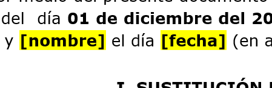
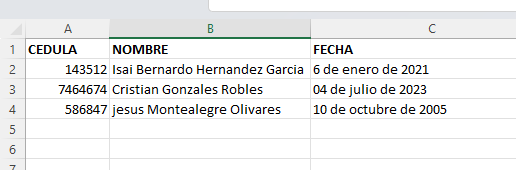

# Automatic Document Generator from Template

This Python script facilitates the automatic creation of Word documents (.docx) from a predefined template. The template should contain placeholder markers, such as `[name]`, `[id]`, which will be replaced with specific values.

## Operation

1. **Document Template:**
   - Create a Word document with placeholder markers that match the column names in your Excel file. For example: `[name]`, `[id]`.
   - 

2. **Excel File:**
   - Prepare an Excel file with data. Ensure that the columns have the same names as the markers in the template.
   - 

3. **Script Configuration:**
   - In the script, define the field mapping by indicating the template markers and their corresponding column names in Excel.
   - Note that the dictionary keys must match the template markers, and the values must match the column names in Excel.

   ```python
   # Define the field mapping (marker in the document: column name in Excel)
   field_mapping = {
    #--Marker--:--Excel Column----#
       "[name]": "NAME",
       "[id]": "ID",
       "[date]": "DATE",
   }
   ```

4. **Script Execution:**
   - Run the script. The generated documents will be stored in a folder called `generated-documents`.

   ```bash
   python generate.py
   ```

## Requirements

Make sure you have the necessary libraries installed:

```bash
pip install pandas python-docx
```

## Credits

This script was created by me, [@Isai_hernandez]
