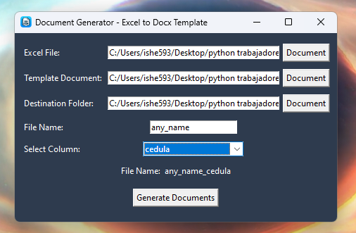
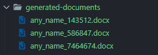
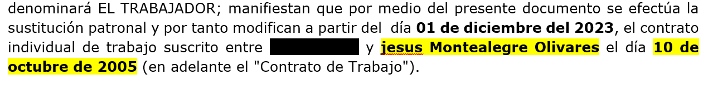

#  Automatic Document Generator from Template

This Python script facilitates the automatic creation of Word documents (.docx) from a predefined template. The template should contain placeholder markers, such as `[name]`, `[id]`, which will be replaced with specific values.

## How to use

1. **Document Template:**
   - Create a Word document with placeholder markers that match the column names in your Excel file. For example: `[name]`, `[id]`.
    

2. **Excel File:**
   - Prepare an Excel file with data. Ensure that the columns have the same names as the markers in the template.
    

3. **Open .exe file:**
   - Open the .exe file and follow the instructions.
    

4. **Fill in the fields:**
   - Fill in the fields with the path of the doc template and the Excel file.
   - *File name* is optional, it will be the prefix of the documents.
   - *Select the column*: Select the column that will be used to name the documents.
   - File name and select the column will be concatenated to name the documents.
    
5. **Done:**
   - Automatically the script will create the documents with the data of the Excel file.
   
6. **Docx result:**
   
  
## If you want to run the script directly

### Requirements

Make sure you have the necessary libraries installed:

```bash
pip install pandas python-docx
```

## Credits

This script was created by me, [@Isai_hernandez]
